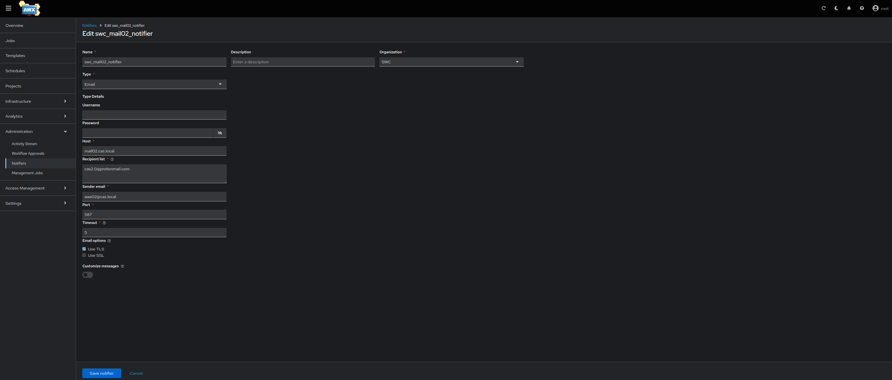
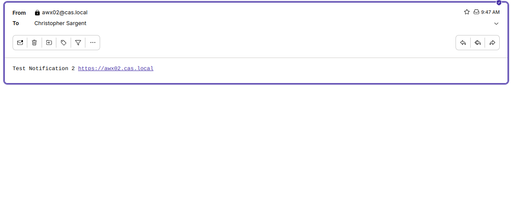

# swc_postfix
* This repository contains steps to build a containerized postfix deployment to act as a smtp relay. For any additional details or inquiries, please contact me at christopher.sargent@sargentwalker.io.
* Tested on Ubuntu 22.04 VM
* deploy mail02.cas.local ubuntu 22.04 VM to run 

# Deploy tools_postfix_1 container
1. ssh cas@172.18.0.17
* nuc03.cas.local
2. sudo -i
3. git clone git@github.com:ChristopherSargent/swc_postfix.git
4. cd swc_postfix
5. vim main.cf
* Note #Update here comments
```
smtpd_banner = $myhostname ESMTP $mail_name (Ubuntu)
biff = no
append_dot_mydomain = no
readme_directory = no
compatibility_level = 2

# Enable TLS for outgoing mail
smtp_tls_security_level = may
smtp_tls_note_starttls_offer = yes

# Enable TLS for incoming mail
smtpd_tls_cert_file = /etc/ssl/certs/postfix.pem
smtpd_tls_key_file = /etc/ssl/private/postfix.key
smtpd_tls_security_level = may
smtpd_tls_auth_only = yes
smtpd_tls_loglevel = 1
smtpd_tls_received_header = yes

# Enable SASL authentication
#smtpd_sasl_type = dovecot
smtpd_sasl_path = private/auth
#smtpd_sasl_auth_enable = yes
#smtpd_recipient_restrictions = permit_sasl_authenticated,permit_mynetworks,reject_unauth_destination

# Adjust smtpd_recipient_restrictions to remove SASL requirement
smtpd_recipient_restrictions = permit_mynetworks, permit_sasl_authenticated, reject_unauth_destination

# Optional: Use strong ciphers and protocols
smtpd_tls_mandatory_protocols = !SSLv2, !SSLv3
smtpd_tls_mandatory_ciphers = medium
smtpd_tls_exclude_ciphers = aNULL, MD5
smtp_tls_loglevel = 1

#smtp_tls_CApath=/etc/ssl/certs
#smtp_tls_security_level=may
#smtp_tls_session_cache_database = btree:${data_directory}/smtp_scache

smtpd_relay_restrictions = permit_mynetworks permit_sasl_authenticated defer_unauth_destination
myhostname = mail02.cas.local #Update here
alias_maps = hash:/etc/aliases
alias_database = hash:/etc/aliases
#myorigin = /etc/mailname
mydestination = $myhostname, mail02.cas.local, localhost.localdomain, localhost #Update here
relayhost =
mynetworks = 127.0.0.0/8 [::ffff:127.0.0.0]/104 [::1]/128 172.18.0.0/24 #Update here
mailbox_size_limit = 0
recipient_delimiter = +
inet_interfaces = all
inet_protocols = all
maillog_file = /var/log/mail.log
```
6. mkdir ssl && cd ssl && openssl req -new -x509 -days 365 -nodes -out postfix.pem -keyout postfix.key
7. cd ..
8. docker build -f Dockerfile -t swc_postfix:1109202401 .
9. docker network create --subnet=10.1.1.0/24 tools_postfix_network
10. docker run -d --name tools_postfix_1 --network tools_postfix_network -p 25:25 -p 465:465 -p 587:587 swc_postfix:1109202401
11. echo "172.18.0.17 mail02.cas.local" >> /etc/hosts

# Copy certs to awx02.cas.local

### Update trusted cert on awx02 vm and tools_awx_1 container
* Ubuntu 22.04 VM
1. scp ssl/postfix.pem cas@172.18.0.35:
2. ssh cas@172.18.0.35
3. sudo -i 
4. echo "172.18.0.17 mail02.cas.local" >> /etc/hosts
5. docker exec tools_awx_1 echo "172.18.0.17 mail02.cas.local" >> /etc/hosts
### Update trust Ubuntu
6. cp /home/cas/postfix.pem /usr/local/share/ca-certificates/postfix.crt
7. update-ca-certificates
```
Updating certificates in /etc/ssl/certs...
rehash: warning: skipping ca-certificates.crt,it does not contain exactly one certificate or CRL
1 added, 0 removed; done.
Running hooks in /etc/ca-certificates/update.d...
done.
```
### Copy cert and update trust (Centos 9 stream) tools_awx_1 container
8. docker cp /home/cas/postfix.pem  tools_awx_1:/etc/pki/ca-trust/source/anchors/postfix.crt
```
Successfully copied 3.07kB to tools_awx_1:/etc/pki/ca-trust/source/anchors/postfix.crt
```
9. docker exec -it -u:0 tools_awx_1 update-ca-trust

### Set up notification in awx UI
10. https://172.18.0.35 > Administration > Notifiers > Create notifier > 
```
Name = swc_mail02_notifier
Organization = SWC
Type = email
host = mail02.cas.local
Receipent list = cas2.0@protonmail.com
Sender email = awx02@cas.local
Port = 587
Timeout =5 
Select TLS
Save
```



11. Select test


12. Test email received


# Manual Tests
1. openssl s_client -connect mail02.cas.local:587 -starttls smtp
* run on VM
2. docker exec -it tools_postfix_1 bash
3. echo -e "Subject: Test Email from Postfix Container\n\nThis is a test email sent from the Postfix container." | sendmail -v cas2.0@protonmail.com
* run from postfix container
# Set outgoing port to 587
1. docker exec -it tools_postfix_1 bash
2. vim /etc/postfix/transport
```
protonmail.com smtp:[mail.protonmail.ch]:587
gmail.com      smtp:[smtp.gmail.com]:587
outlook.com    smtp:[smtp.office365.com]:587
```
3. postmap /etc/postfix/transport
4. vim /etc/postfix/main.cf
* add to the end
```
transport_maps = hash:/etc/postfix/transport
```
5. service postfix restart