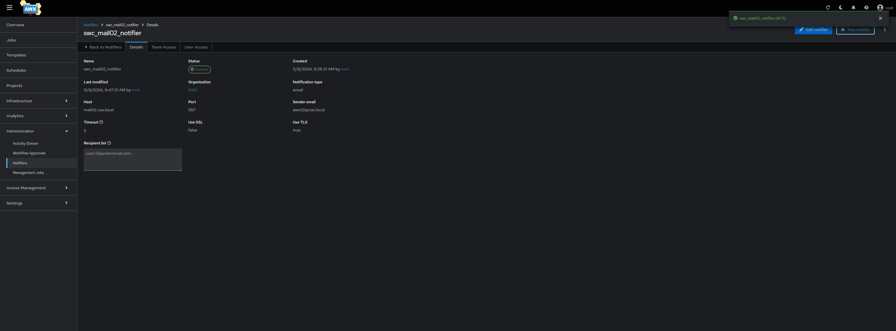

# swc_postfix
* This repository contains steps to build a containerized postfix deployment to act as an smtp relay. For any additional details or inquiries, please contact me at christopher.sargent@sargentwalker.io.
* Tested on Ubuntu 22.04 VM
* deploy mail02.cas.local ubuntu 22.04 VM to run 

# Deploy tools_postfix_1 container
1. ssh cas@172.18.0.17
* nuc03.cas.local
2. sudo -i
3. git clone git@github.com:ChristopherSargent/swc_postfix.git
4. cd swc_postfix
5. vim main.cf
* Note #Update here comments
```
smtpd_banner = $myhostname ESMTP $mail_name (Ubuntu)
biff = no
append_dot_mydomain = no
readme_directory = no
compatibility_level = 2

# Enable TLS for outgoing mail
smtp_tls_security_level = may
smtp_tls_note_starttls_offer = yes

# Enable TLS for incoming mail
smtpd_tls_cert_file = /etc/ssl/certs/postfix.pem
smtpd_tls_key_file = /etc/ssl/private/postfix.key
smtpd_tls_security_level = may
smtpd_tls_auth_only = yes
smtpd_tls_loglevel = 1
smtpd_tls_received_header = yes

# Enable SASL authentication
#smtpd_sasl_type = dovecot
smtpd_sasl_path = private/auth
#smtpd_sasl_auth_enable = yes
#smtpd_recipient_restrictions = permit_sasl_authenticated,permit_mynetworks,reject_unauth_destination

# Adjust smtpd_recipient_restrictions to remove SASL requirement
smtpd_recipient_restrictions = permit_mynetworks, permit_sasl_authenticated, reject_unauth_destination

# Optional: Use strong ciphers and protocols
smtpd_tls_mandatory_protocols = !SSLv2, !SSLv3
smtpd_tls_mandatory_ciphers = medium
smtpd_tls_exclude_ciphers = aNULL, MD5
smtp_tls_loglevel = 1

#smtp_tls_CApath=/etc/ssl/certs
#smtp_tls_security_level=may
#smtp_tls_session_cache_database = btree:${data_directory}/smtp_scache

smtpd_relay_restrictions = permit_mynetworks permit_sasl_authenticated defer_unauth_destination
myhostname = mail02.cas.local #Update here
alias_maps = hash:/etc/aliases
alias_database = hash:/etc/aliases
#myorigin = /etc/mailname
mydestination = $myhostname, mail02.cas.local, localhost.localdomain, localhost #Update here
relayhost =
mynetworks = 127.0.0.0/8 [::ffff:127.0.0.0]/104 [::1]/128 172.18.0.0/24 #Update here
mailbox_size_limit = 0
recipient_delimiter = +
inet_interfaces = all
inet_protocols = all
maillog_file = /var/log/mail.log
```
6. mkdir ssl && cd ssl && openssl req -new -x509 -days 365 -nodes -out postfix.pem -keyout postfix.key
7. cd ..
8. docker build -f Dockerfile -t swc_postfix:1109202401 .
9. docker network create --subnet=10.1.1.0/24 tools_postfix_network
10. docker run -d --name tools_postfix_1 --network tools_postfix_network -p 25:25 -p 465:465 -p 587:587 swc_postfix:1109202401
11. echo "172.18.0.17 mail02.cas.local" >> /etc/hosts

# Copy certs to awx02.cas.local

### Update trusted cert on awx02 vm and tools_awx_1 container
* Ubuntu 22.04 VM
1. scp ssl/postfix.pem cas@172.18.0.35:
2. ssh cas@172.18.0.35
3. sudo -i 
4. echo "172.18.0.17 mail02.cas.local" >> /etc/hosts
5. docker exec tools_awx_1 echo "172.18.0.17 mail02.cas.local" >> /etc/hosts
### Update trust Ubuntu
6. cp /home/cas/postfix.pem /usr/local/share/ca-certificates/postfix.crt
7. update-ca-certificates
```
Updating certificates in /etc/ssl/certs...
rehash: warning: skipping ca-certificates.crt,it does not contain exactly one certificate or CRL
1 added, 0 removed; done.
Running hooks in /etc/ca-certificates/update.d...
done.
```
### Copy cert and update trust (Centos 9 stream) tools_awx_1 container
8. docker cp /home/cas/postfix.pem  tools_awx_1:/etc/pki/ca-trust/source/anchors/postfix.crt
```
Successfully copied 3.07kB to tools_awx_1:/etc/pki/ca-trust/source/anchors/postfix.crt
```
9. docker exec -it -u:0 tools_awx_1 update-ca-trust

### Set up notification in awx UI
10. https://172.18.0.35 > Administration > Notifiers > Create notifier > 
```
Name = swc_mail02_notifier
Organization = SWC
Type = email
host = mail02.cas.local
Receipent list = cas2.0@protonmail.com
Sender email = awx02@cas.local
Port = 587
Timeout =5 
Select TLS
Save
```


11. Select test



12. Test email received


### Commit above changes to tools_awx_1 container
* on awx VM
13. docker ps
```
CONTAINER ID   IMAGE                              COMMAND                  CREATED      STATUS      PORTS                                                                                                                                                                                                                                                                                                                                                                                  NAMES
188ed4ec0c47   tools_awx_1:latest                 "/entrypoint.sh laun…"   4 days ago   Up 2 days   0.0.0.0:2222->2222/tcp, :::2222->2222/tcp, 0.0.0.0:6899->6899/tcp, :::6899->6899/tcp, 0.0.0.0:7899-7999->7899-7999/tcp, :::7899-7999->7899-7999/tcp, 0.0.0.0:8013->8013/tcp, :::8013->8013/tcp, 0.0.0.0:8080->8080/tcp, :::8080->8080/tcp, 22/tcp, 0.0.0.0:9888->9888/tcp, :::9888->9888/tcp, 0.0.0.0:3000->3001/tcp, [::]:3000->3001/tcp, 0.0.0.0:443->8043/tcp, [::]:443->8043/tcp   tools_awx_1
c8e0a6ccbdbd   quay.io/sclorg/postgresql-15-c9s   "container-entrypoin…"   4 days ago   Up 2 days   0.0.0.0:5441->5432/tcp, [::]:5441->5432/tcp                                                                                                                                                                                                                                                                                                                                            tools_postgres_1
2b3140189197   redis:latest                       "redis-server /usr/l…"   4 days ago   Up 2 days   6379/tcp                                                                                                                                                                                                                                                                                                                                                                               tools_redis_1
38750153e3fa   registry:2                         "/entrypoint.sh /etc…"   4 days ago   Up 2 days   0.0.0.0:5000->5000/tcp, :::5000->5000/tcp                                                                                                                                                                                                                                                                                                                                              tools_registry_1
```
14. docker image ls
```
REPOSITORY                         TAG       IMAGE ID       CREATED         SIZE
tools_awx_1                        latest    03a50c50c2ca   4 days ago      4.57GB
172.18.0.103:5000/awx-ee           latest    e6746a400403   4 days ago      2.31GB
quay.io/ansible/awx-ee             latest    e6746a400403   4 days ago      2.31GB
ghcr.io/ansible/awx_devel          devel     783d8506e5c7   5 days ago      2.07GB
quay.io/sclorg/postgresql-15-c9s   latest    2e03bd7220a4   10 days ago     372MB
redis                              latest    f02a7f566928   5 weeks ago     117MB
registry                           2         75ef5b734af4   13 months ago   25.4MB
```
15. docker commit tools_awx_1 tools_awx_1:latest


# Manual Tests
1. openssl s_client -connect mail02.cas.local:587 -starttls smtp
* run on VM
2. docker exec -it tools_postfix_1 bash
3. echo -e "Subject: Test Email from Postfix Container\n\nThis is a test email sent from the Postfix container." | sendmail -v cas2.0@protonmail.com
* run from postfix container
# Set outgoing port to 587
1. docker exec -it tools_postfix_1 bash
2. vim /etc/postfix/transport
* Follow steps here to set up ip whitelisting for auth for gmail smtp [cmail.smtp.relay.config](https://apps.google.com/supportwidget/articlehome?hl=en&article_url=https%3A%2F%2Fsupport.google.com%2Fa%2Fanswer%2F2956491%3Fhl%3Den&assistant_id=generic-unu&product_context=2956491&product_name=UnuFlow&trigger_context=a
)
```
gmail.com      smtp:[smtp.gmail.com]:587
```
3. postmap /etc/postfix/transport
4. cd /etc/postfix && mv main.cf main.cf.12012024
5. vim /etc/postfix/main.cf
* add to the end
```
smtpd_banner = $myhostname ESMTP $mail_name (Ubuntu)
biff = no
append_dot_mydomain = no
readme_directory = no
compatibility_level = 2

# Enable TLS for outgoing mail
smtp_tls_note_starttls_offer = yes

# Enable TLS for incoming mail
smtpd_tls_cert_file = /etc/ssl/certs/postfix.pem
smtpd_tls_key_file = /etc/ssl/private/postfix.key
smtpd_tls_auth_only = yes
smtpd_tls_loglevel = 1
smtpd_tls_received_header = yes

# Enable SASL authentication
smtpd_sasl_path = private/auth

# Adjust smtpd_recipient_restrictions to remove SASL requirement
smtpd_recipient_restrictions = permit_mynetworks, permit_sasl_authenticated, reject_unauth_destination

# Optional: Use strong ciphers and protocols
smtpd_tls_mandatory_protocols = !SSLv2, !SSLv3
smtpd_tls_mandatory_ciphers = medium
smtpd_tls_exclude_ciphers = aNULL, MD5
smtp_tls_loglevel = 1
smtpd_relay_restrictions = permit_mynetworks permit_sasl_authenticated defer_unauth_destination
myhostname = smtp01.swc.io
alias_maps = hash:/etc/aliases
alias_database = hash:/etc/aliases
mydestination = $myhostname, smtp01.swc.io, localhost.localdomain, localhost
mynetworks = 127.0.0.0/8 [::ffff:127.0.0.0]/104 [::1]/128 188.40.189.32/27 95.216.127.40/29 65.109.78.150 46.4.105.241 10.1.5.0/24
mailbox_size_limit = 0
recipient_delimiter = +
inet_interfaces = all
#Enable the below line and update line 25 of Dockerfile tail -f /var/log/mail.log to get mail log via docker logs command against container
maillog_file = /var/log/mail.log
transport_maps = hash:/etc/postfix/transport
#Add sasl and google relay
relayhost = [smtp-relay.gmail.com]:587
smtp_sasl_security_options = noanonymous
smtp_tls_security_level = encrypt
smtp_tls_CAfile = /etc/ssl/certs/ca-certificates.crt
inet_protocols = ipv4
transport_maps = hash:/etc/postfix/transport
```
6. service postfix reload
```
postfix: Postfix is running with backwards-compatible default settings
postfix: See http://www.postfix.org/COMPATIBILITY_README.html for details
postfix: To disable backwards compatibility use "postconf compatibility_level=3.6" and "postfix reload"
postfix/postfix-script: refreshing the Postfix mail system
```
7. echo -e "Subject: Test Email from smtp01.swc.io Postfix Container." | sendmail -v christopher.sargent@sargentwalker.io && tail -f /var/log/mail.log
```
Dec 01 17:53:22 smtp01 postfix/pickup[327]: 1DCB91C2315: uid=0 from=<root>
Dec 01 17:53:22 smtp01 postfix/cleanup[345]: 1DCB91C2315: message-id=<20241201175322.1DCB91C2315@smtp01.swc.io>
Dec 01 17:53:22 smtp01 postfix/qmgr[326]: 1DCB91C2315: from=<root@smtp01.swc.io>, size=302, nrcpt=1 (queue active)
Dec 01 17:53:22 smtp01 postfix/smtp[349]: Trusted TLS connection established to smtp-relay.gmail.com[74.125.128.28]:587: TLSv1.3 with cipher TLS_AES_256_GCM_SHA384 (256/256 bits) key-exchange X25519 server-signature ECDSA (P-256) server-digest SHA256
Dec 01 17:53:22 smtp01 postfix/smtp[349]: 1DCB91C2315: to=<christopher.sargent@sargentwalker.io>, relay=smtp-relay.gmail.com[74.125.128.28]:587, delay=0.36, delays=0.02/0.04/0.15/0.14, dsn=2.0.0, status=sent (250 2.0.0 OK  1733075602 ffacd0b85a97d-385ccd68a77sm336259f8f.78 - gsmtp)
Dec 01 17:53:22 smtp01 postfix/cleanup[345]: 7622F1C2319: message-id=<20241201175322.7622F1C2319@smtp01.swc.io>
Dec 01 17:53:22 smtp01 postfix/qmgr[326]: 7622F1C2319: from=<>, size=2150, nrcpt=1 (queue active)
Dec 01 17:53:22 smtp01 postfix/bounce[350]: 1DCB91C2315: sender delivery status notification: 7622F1C2319
Dec 01 17:53:22 smtp01 postfix/qmgr[326]: 1DCB91C2315: removed
Dec 01 17:53:22 smtp01 postfix/local[352]: 7622F1C2319: to=<root@smtp01.swc.io>, relay=local, delay=0.02, delays=0/0.01/0/0, dsn=2.0.0, status=sent (delivered to mailbox)
Dec 01 17:53:22 smtp01 postfix/qmgr[326]: 7622F1C2319: removed
```
